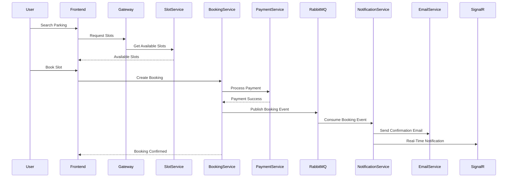
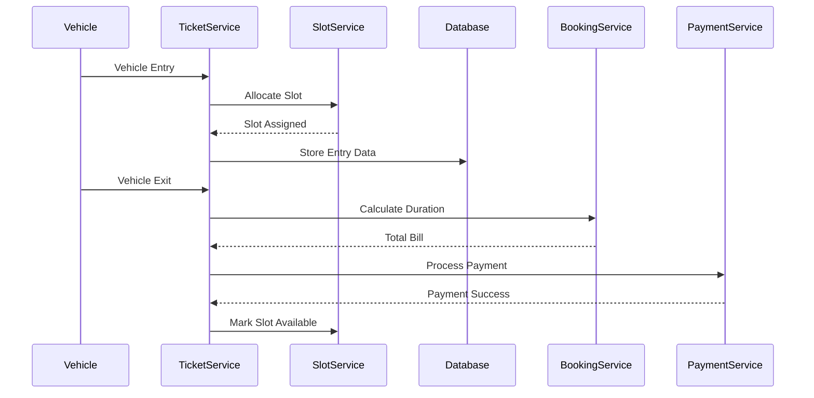
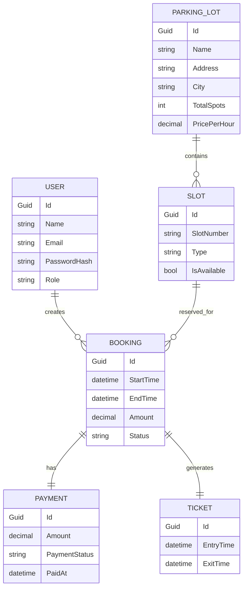

# 🚗 ParkEase - Smart Parking Lot Management System

ParkEase is a scalable and modern **Smart Parking Lot Management System** developed using **ASP.NET Core**, **Angular**, and **Microservices Architecture**.

The system allows users to:

- Find nearby parking lots
- Book parking slots online
- Track vehicle entry & exit
- Make secure online payments
- Receive real-time notifications
- Manage parking lots efficiently

---

# 🚀 Tech Stack

| Technology | Usage |
|---|---|
| ASP.NET Core Web API | Backend Development |
| Angular | Frontend Development |
| PostgreSQL | Database |
| Entity Framework Core | ORM |
| RabbitMQ | Event-Driven Communication |
| Redis | Distributed Caching |
| SignalR | Real-Time Notifications |
| JWT Authentication | Security |
| Docker | Containerization |
| YARP API Gateway | API Gateway |
| Swagger | API Documentation |

---

# 🏗 System Architecture

The project follows:

- ✅ Microservices Architecture
- ✅ Clean Architecture
- ✅ Event-Driven Architecture
- ✅ N-Tier Layered Structure

---

# 📌 Microservices Used

| Service | Responsibility |
|---|---|
| AuthService | Authentication & Authorization |
| ParkingLotService | Manage parking lots |
| SlotService | Manage parking slots |
| BookingService | Handle slot bookings |
| TicketService | Vehicle entry & exit |
| PaymentService | Online payment processing |
| NotificationService | Email & real-time notifications |
| API Gateway | Request routing |

---

# 📌 Core Features

# 👤 User Features

✅ User Registration & Login  
✅ JWT Authentication  
✅ Search Nearby Parking Lots  
✅ View Slot Availability  
✅ Book Parking Slot  
✅ Extend Booking  
✅ Cancel Booking  
✅ Online Payment  
✅ Booking History  
✅ Real-Time Notifications  
✅ Vehicle Entry & Exit Tracking  

---

# 🅿 Parking Lot Manager Features

✅ Create Parking Lots  
✅ Add Parking Slots  
✅ Manage Slot Availability  
✅ View Active Bookings  
✅ Revenue Monitoring  
✅ Receive Booking Notifications  

---

# ⚡ Core Functionalities

# 1️⃣ Authentication System

Secure authentication system using JWT tokens.

### Features

- Register
- Login
- Password Hashing
- JWT Token Generation
- Role-Based Access Control (RBAC)

---

# 2️⃣ Parking Lot Management

Managers can:

- Create parking lots
- Update parking lot details
- Configure pricing
- Add parking slots

---

# 3️⃣ Slot Management

Supports multiple parking slot types.

| Slot Type |
|---|
| Compact |
| Standard |
| Large |
| EV Charging |
| Handicapped |

---

# 4️⃣ Booking Management

Users can:

- Book parking slots
- Extend booking duration
- Cancel bookings
- View booking history

---

# 5️⃣ Vehicle Entry & Exit

Handles:

- Vehicle entry
- Ticket generation
- Exit processing
- Billing calculation

---

# 6️⃣ Online Payments

Supports payment integrations like:

- Razorpay
- Stripe

---

# 7️⃣ Real-Time Notifications

Implemented using:

- SignalR
- RabbitMQ
- Email Notifications

Notifications include:

- Booking confirmations
- Payment receipts
- Booking expiry reminders
- Cancellation alerts

---

# 🧠 Redis Caching

Redis is used for:

- Slot availability caching
- Faster API responses
- Frequently accessed parking data

---

# ⚡ RabbitMQ Event Communication

RabbitMQ enables asynchronous communication between microservices.

## Example Workflow

```text
Booking Created
        ↓
RabbitMQ Event Published
        ↓
Notification Service Consumes Event
        ↓
Email + SignalR Notification Sent
```

---

# 🌐 YARP API Gateway

The API Gateway handles:

- Request Routing
- Authentication Validation
- Request Forwarding
- Load Distribution

---

# 📂 Project Structure

```text
ParkEase
│
├── ApiGateway
│
├── BuildingBlocks
│   ├── Common
│   ├── Contracts
│   ├── EventBus
│   ├── Infrastructure
│
├── Services
│   ├── AuthService
│   ├── ParkingLotService
│   ├── SlotService
│   ├── BookingService
│   ├── TicketService
│   ├── PaymentService
│   ├── NotificationService
│
├── Frontend
│   ├── Angular App
│
├── docker-compose.yml
│
└── README.md
```

---

# 🏗 Clean Architecture Structure

Each microservice follows this architecture:

```text
Service
│
├── API
│   ├── Controllers
│   ├── Middleware
│   ├── Program.cs
│
├── Application
│   ├── Commands
│   ├── Queries
│   ├── DTOs
│   ├── Interfaces
│
├── Domain
│   ├── Entities
│   ├── Enums
│   ├── ValueObjects
│
├── Infrastructure
│   ├── DbContext
│   ├── Repositories
│   ├── Services
│
└── Tests
```

---

# 🔄 Complete Workflow

# 🚘 Parking Slot Booking Workflow

```text
User Searches Parking Lot
          ↓
View Available Slots
          ↓
Select Slot
          ↓
Booking Created
          ↓
Payment Completed
          ↓
RabbitMQ Event Published
          ↓
Notification Service Sends:
- Email
- Real-Time Notification
          ↓
Booking Confirmed
```

---

# 🚗 Vehicle Entry Workflow

```text
Vehicle Arrives
        ↓
Ticket Generated
        ↓
Slot Marked Occupied
        ↓
Entry Time Stored
```

---

# 🚪 Vehicle Exit Workflow

```text
Vehicle Exit
      ↓
Duration Calculated
      ↓
Bill Generated
      ↓
Payment Completed
      ↓
Slot Marked Available
```

---

# 🏗 UML DIAGRAMS

# 📌 1. High-Level System Architecture Diagram

```mermaid
flowchart LR

Client[Angular Frontend]
        ↓
Gateway[YARP API Gateway]

Gateway --> AuthService
Gateway --> ParkingLotService
Gateway --> SlotService
Gateway --> BookingService
Gateway --> TicketService
Gateway --> PaymentService
Gateway --> NotificationService

BookingService --> RabbitMQ
RabbitMQ --> NotificationService

NotificationService --> SignalR
NotificationService --> EmailService

Services --> PostgreSQL
Services --> Redis
```

---

# 📌 2. Booking Sequence Diagram



---

# 📌 3. Authentication Flow Diagram

```mermaid
flowchart LR

A[User Login]
    ↓
B[Validate Credentials]
    ↓
C[Generate JWT Token]
    ↓
D[Return JWT Token]
    ↓
E[Access Protected APIs]
```

---

# 📌 4. Vehicle Entry & Exit Sequence Diagram



---

# 🗄 DATABASE MODEL (ER / DML DIAGRAM)



---

# 🌐 API Endpoints

# 🔑 Authentication APIs

| Method | Endpoint |
|---|---|
| POST | `/api/auth/register` |
| POST | `/api/auth/login` |

---

# 🅿 Parking Lot APIs

| Method | Endpoint |
|---|---|
| POST | `/api/parkinglots` |
| GET | `/api/parkinglots` |
| PUT | `/api/parkinglots/{id}` |

---

# 🚘 Slot APIs

| Method | Endpoint |
|---|---|
| POST | `/api/slots` |
| GET | `/api/slots/available` |

---

# 📖 Booking APIs

| Method | Endpoint |
|---|---|
| POST | `/api/bookings` |
| PUT | `/api/bookings/extend` |
| DELETE | `/api/bookings/cancel` |

---

# 🎫 Ticket APIs

| Method | Endpoint |
|---|---|
| POST | `/api/tickets/entry` |
| PUT | `/api/tickets/exit` |

---

# 📧 Notification APIs

| Method | Endpoint |
|---|---|
| GET | `/api/notifications` |

---

# ⚙️ Installation & Setup

# 1️⃣ Clone Repository

```bash
git clone https://github.com/Khushi-084/ParkEase.git
```

---

# 2️⃣ Navigate to Project

```bash
cd ParkEase
```

---

# 3️⃣ Run Docker Containers

```bash
docker-compose up -d
```

---

# 4️⃣ Apply Database Migrations

```bash
dotnet ef database update
```

---

# 5️⃣ Run Backend Services

```bash
dotnet run
```

---

# 6️⃣ Run Angular Frontend

```bash
npm install
ng serve
```

---

# 📖 Swagger URL

```text
https://localhost:5001/swagger
```

---

# 📸 Screenshots

```markdown


```

---

# 🚀 Future Enhancements

- AI-Based Parking Prediction
- Dynamic Pricing
- QR-Based Vehicle Entry
- Mobile Application
- Google Maps Integration
- Kubernetes Deployment
- CI/CD Pipeline

---

# 👩‍💻 Author

## Khushi Rathi

- GitHub: https://github.com/Khushi-084
- LinkedIn: https://www.linkedin.com/in/khushi-rathi-923a09255/

---

# ⭐ Project Highlights

✅ Microservices Architecture  
✅ RabbitMQ Event-Driven Communication  
✅ SignalR Real-Time Notifications  
✅ Redis Caching  
✅ JWT Authentication  
✅ Dockerized Infrastructure  
✅ YARP API Gateway  
✅ PostgreSQL Integration  
✅ Angular Frontend  
✅ Clean Architecture  
✅ Scalable Backend Design  

---

# 🌟 If you like this project, give it a star on GitHub!
